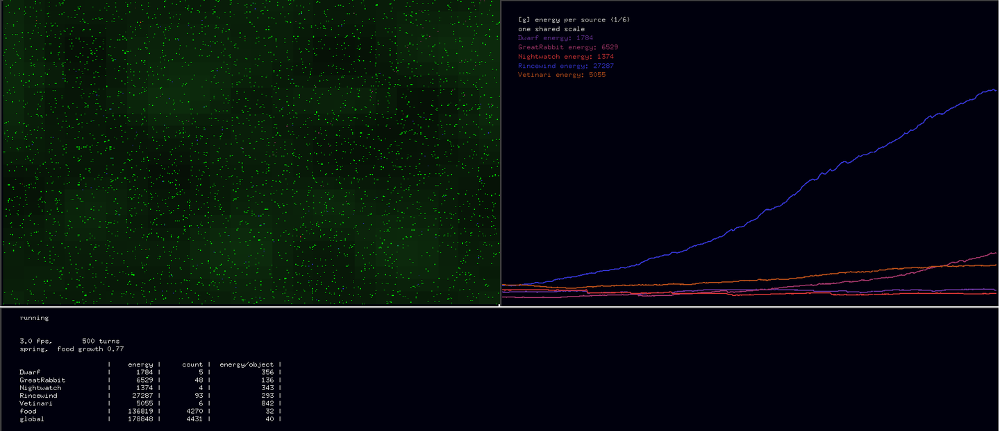

wesen
=====

Wesen - little game where players have to program the behavior of their
Wesens to defeat the other players (like CoreWars).

Creatures live on a toroidal grid where food grows. You write the AI
that decides, every turn, what one of your creatures does: move, look
around, eat, breed, attack, talk to its neighbours. Everyone's AI is
dropped into the same world, and the one whose creatures are still
alive and holding the most energy at the end wins. The engine settles
the rest: the same seed always plays the same game.



Above, five sources 500 turns in. The blue runaway is `Rincewind`,
which spends everything it eats on more Rincewinds; the four flat lines
are colonies that hold their ground and lose on volume.


Quick start
=====

Needs [uv](https://docs.astral.sh/uv/) and nothing else. Playing a
scored match in the terminal does not need the graphics stack, so start
there:

```sh
git clone https://github.com/konradvoelkel/wesen.git
cd wesen
uv sync
uv run wesen-tournament --turns 400 -s Dwarf,Nightwatch,Rincewind
```

That plays a whole game and scores it (under a minute):

```
# seed 1
wesen: game seed 1
turn              food          Dwarf     Nightwatch      Rincewind
    250  3370/  116799     4/    1290     5/    1650    23/    5363
    400  4478/  162296     4/    1181     5/    1605    73/   19025
# 400 turns in 42.3s (9 turns/s), 4563 objects left
        source       mean     energy       peak  count   alive    cpu
     Rincewind       6142      19025      19025     73   100%   90%
    Nightwatch       1715       1605       1883      5   100%    3%
         Dwarf       1265       1181       1661      4   100%    7%
```

Rincewind won this one by turning food into more Rincewinds. `mean` is
the score (energy averaged over the whole game, not just the last
turn), `count` how many were left and `cpu` how much of the real time
that source's own code took. A full match is 2000 turns and several
seeds - `--seeds 1,2,3` averages them, so one lucky world cannot decide
it.


Watch it
=====

The GUI has one dependency that is not a python package, freeglut:

```sh
sudo apt install freeglut3-dev     # or: pacman -S freeglut, brew install freeglut
uv run wesen
```

**The GUI starts paused; press space.** Press `?` for the key list,
`g` to switch what the graph plots, `q` to save the game and quit.
`./wesen` does the same thing as `uv run wesen`.

On a machine with no screen — a server, a container — leave the window
out: `uv run wesen --disablegui` plays the same game and prints its
stats.


Write a wesen
=====

Put a source of your own in `~/.wesen/sources` — either a single file
`MyWesen.py` or a folder `MyWesen/main.py` — and play it against the
sources shipped with the game:

```sh
uv run wesen -s MyWesen,Dwarf,Rincewind
uv run wesen-tournament --turns 2000 --seeds 1,2,3 -s MyWesen,Dwarf,Rincewind
```

`-p DIR` adds another folder to look in.
`src/Wesen/sources/example.py` is the empty template to copy, and the
sources next to it are worth reading: `GreatRabbit` is forty lines,
`Dwarf` is a mining clan you can hold in your head, `Rincewind` runs a
colony that gossips.

**[`SOURCES.md`](SOURCES.md) is the guide** — the whole API, the rules
that decide games, and what each existing source does. Read it before
writing anything; the rules of the food economy are not guessable.


Develop
=====

```sh
uv run ruff check && uv run ruff format --check
uv run mypy src
uv run python -m unittest discover -s tests -t . -p '*.py'
```

The same three commands run in CI, on the oldest and the newest Python
the project supports. The tests play real games: `tests/determinism.py`
plays one seed in two fresh interpreters and compares, and
`tests/game.py` plays every shipped source through a whole game and
checks that nobody broke a rule. Neither needs a display.

[`OVERVIEW.md`](OVERVIEW.md) maps the codebase and records what
happened when the sources were played against each other. `tools/` has
the profiler and the micro-benchmarks; `local/` is for throwaway
scripts and is not tracked.


If something goes wrong
=====

| it says | it means |
|---|---|
| `cannot open a window` | no graphical session here: play with `--disablegui`, or run `wesen-tournament` |
| `PyOpenGL is not installed` | `uv sync` has not been run yet |
| `the dependencies are not installed yet` | the same, for `./wesen` before the first `uv sync` |
| `It needs freeglut`, `glutInit is undefined` | the system library is missing (see [Watch it](#watch-it)) |
| `no wesen source called 'X'` | the name must match the file or folder in `~/.wesen/sources`; the message lists every place it looked |
| `X keeps state on its class` | not an error: the engine gave every wesen its own copy of it, see `[wesen] shared_state` |

The game keeps its config at `~/.wesen/conf` (written from the defaults
on first run) and its saved game at `~/.wesen/gamestate`. Delete either
to start over; `uv run wesen --defaultconfig` rewrites the config and
`--printconfig` shows what is in force.


History
=====

  * 2003 version 0.1 for Python 2
  * 2013 version 0.6 for Python 3
  * 2026 version 0.7 for Python >= 3.10

Copyright 2003-2013 by Konrad Voelkel and Reimer Backhaus. Free
software under the GNU General Public License, version 3 or later:
see [`LICENSE`](LICENSE).
